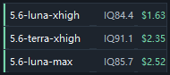

# Codex 档位展示窗

## 这个项目是做什么的？

使用 Codex 写代码时，模型名称、推理强度、IQ 和费用往往分散在不同页面里。模型越强通常越贵，而最便宜的模型又不一定能满足复杂任务；用户很难快速判断“当前任务应该用哪个档位”。

本项目提供一个常驻桌面的紧凑悬浮窗，把 Codex 雷达公开跑测数据中的模型档位集中显示出来，并自动找出当前性价比最高的三个选择：

- 模型短名称，例如 `5.6-terra-xhigh`；
- IQ 智力评分；
- 单次平均费用；
- 基于 IQ 与费用的性价比排序。

它解决的是“在满足最低智力要求的前提下，快速找到更划算模型”的问题，让用户不用反复打开网页、查表和手工计算。

## 悬浮窗预览



预览中的数值来自公开数据示例，实际内容会随数据源刷新而变化。

## 核心行为

- 始终显示三个排名靠前的模型档位，只展示模型名、IQ 和费用。
- 每次启动及之后每 10 分钟，遍历数据源全部模型档位并重新计算。
- IQ 达到 80 的模型进入优先组，再按 `IQ ÷ 费用` 从高到低排序。
- IQ 未达标或缺少有效数据的模型排在后面。
- 网络暂时不可用时使用本机缓存。
- 可按住任意一行拖动窗口，按 Escape 隐藏窗口。
- 右键系统托盘图标可显示、隐藏、刷新、退出或切换开机自启。

## 它不会做什么？

本项目是只读展示工具：

- 不读取或修改 Codex 配置文件；
- 不切换模型；
- 不重启或控制 Codex；
- 不上传代码、提示词或账户信息。

## 快速开始

普通用户不需要安装 Python：

1. 从 [Releases](https://github.com/lztpho/codex-tier-widget/releases/latest) 下载 `CodexTierWidget.exe`；
2. 将 EXE 放到一个固定目录；
3. 双击运行。

首次运行默认开启当前用户的开机自启，不需要管理员权限。右键托盘图标，点击带勾的“开机自启”即可关闭；再次点击可重新开启。

从源码运行仅用于开发：

```powershell
python -m pip install -r requirements.txt
python scripts/launch_widget.py
```

启动后窗口会出现在屏幕右下角，右下角通知区域也会出现托盘图标。按 Escape 只隐藏窗口，要完全退出请从托盘菜单选择“退出程序”。

## 排名规则

排名采用“能力门槛 + 性价比”的两阶段规则：

1. IQ ≥ 80 的档位优先；
2. 优先组按 `score = IQ / average_price_usd` 从高到低排序；
3. IQ 未达标的档位排在后面，再按性价比排序；
4. 缺少 IQ 或费用的档位固定排在最后。

因此，程序不会因为某个模型价格低就直接推荐它，也不会只追求最高 IQ 而忽略费用。

## 配置

在 [config.py](src/codex_tier_widget/config.py) 中可以调整：

```python
MINIMUM_IQ = 80.0
DISPLAY_LIMIT = 3
```

`DISPLAY_LIMIT` 建议保持为 3，以维持悬浮窗的紧凑尺寸。修改后重新启动悬浮窗即可。

## 数据与隐私

数据来自 [Codex 雷达](https://codexradar.com/) 网页使用的公开实时任务表接口。程序按网页相同规则聚合 IQ 与费用，旧公开快照只用于首次运行时的网络降级。程序只会写入自己的离线缓存和当前用户的 Windows 自启设置，不会访问 `~/.codex/config.toml`，也不需要管理员权限。

## 开发与校验

```powershell
python tools/dev_check.py all
python tools/release_check.py
powershell -ExecutionPolicy Bypass -File scripts/build_windows_exe.ps1
```

更多内容：

- [安装指南](INSTALL.md)
- [使用说明](USAGE.md)
- [架构说明](docs/ARCHITECTURE.md)
- [常见问题](docs/FAQ.md)
- [贡献指南](CONTRIBUTING.md)
- [更新日志](CHANGELOG.md)
